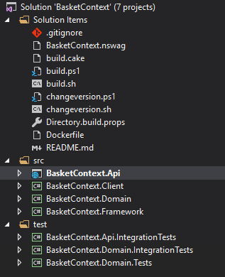
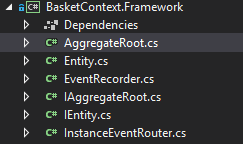

# Basket Context

# Environment
* Visual Studio 2017
* NCrunch 3.16.0.1 for continous testing
* reSharper 2018.1

# Used Framework
* .NET Core 2.0

# Used Libraries & Tools

## Testing
* `FluentAssertions` (https://github.com/fluentassertions/fluentassertions)
* `FakeItEasy` for mocking (https://github.com/FakeItEasy/FakeItEasy)
* `xUnit` for test runner (https://github.com/xunit/xunit)
* `Bogus` for faking some values (https://github.com/bchavez/Bogus)

## Build pipeline
* `cakebuild` (https://cakebuild.net/)
* `changeversion.sh` and `build.sh` for unix pipeline 
* `changeversion.ps1` for windows ci pipeline
    * These files are being used in `build.cake` file
* `Directory.build.props` for injecting `Version` to all `csproj` files

#### Build Parameters
* `buildNumber`
* `branch`
* `cfg`
* To execute: `./build.ps1 -buildNumber=102 -branch="dev" -cfg="release"`

Cake calls `changeversion.ps1` or `changeverison.sh` with `buildNumber` depending to your build environment, that will allow to produce a new version of your Nuget packages.

Changing the version affects the `BasketContext.Client` only. It is assumed as nuget package that should be published by user with every successful *dev* *to* *master* merge. 

#### Docker

This Web API application can be hosted with `Docker`.

Build: `docker build -t basketcontext .`

Run: `docker run -p 5000:5000 -i -t basketcontext`

#### Nuget
There is a `nugetApiKey` variable inside of Cake script. If developer wants to produce and push a Nuget package to Official Nuget Repository(which is assumed) then user needs to provide an environment variable with named as `nugetApiKey`.

To create a new nuget package and build you can execute:

`./build.ps1 -buildNumber=102 -branch="master" -cfg="release"`

Note that only master branch can create a Nuget package when it is built.

# Implementation

## Architectural Principles & Modeling

Domain Driven Design principles are used in this problem. Therefore given name is `BasketContext` to this solution. `Context` means that, this is a bounded context which provides a solution to Basket domain.

`BasketContext` has an API to interact with. 

API uses;

* [Swagger](https://github.com/domaindrivendev/Swashbuckle) for documentation
* [EntityFrameworkCore](https://github.com/aspnet/EntityFrameworkCore) in-memory to database
* [MediatR](https://github.com/jbogard/MediatR) for emphasizing and handling for the commands. Also this brings that initial implementation of **CQRS** with seperating command side from the query side
* [NSwag](https://github.com/RSuter/NSwag) for auto client API creation
* [FluentValidation](https://github.com/JeremySkinner/FluentValidation) for request validation

### BasketContext.Framework

There is a framework project in the solution. That provides an infrastructure to modeling the domain. That means that, for instance if we need to create an event-aware domain model we need to take `AggregateRoot` as a base class of our domain model. Like as `Basket : AggregateRoot<Guid>`. Framework project simply provides a base solution for registering domain events. Also this is same for `Entity`, the lense we look for the Domain Driven Design needs that `BasketItem` must be entity. Therefore **BasketItem** should be an **Entity** like `BasketItem : Entity<Guid>`.

### Command Handling

There is a command handler which named `BasketCommandHandler` and it handles use cases of context. 

Another part is domain events. Domain events are published from `Basket` aggregate root and they are handled by `BasketEventHandler` for informing other bounded contexts or creating some projections.

Event Storming is used for modeling the domain. To help this out [WebEventStorming](https://webeventstorming.com/) is used.

 
## Unit Testing & Integration Testing

There are 3 parts of testing. Two of them are integration testings the other one is unit test. 

**BasketContext.Api.IntegrationTests** uses:

* [Microsoft.AspNetCore.TestHost](https://www.nuget.org/packages/Microsoft.AspNetCore.TestHost/) for controller tests

**BasketContext.Domain.IntegrationTests** uses:

* [EntityFrameworkCore](https://github.com/aspnet/EntityFrameworkCore) in-memory database as application itself does.

**BasketContext.Domain.Tests** uses:

* For testing the behaviors of `Basket` aggregate root. Ensuring the behaviors of aggregate root can be made with ensuring the domain events that in consequence of use-cases which needed to be modeled at the first place. This need is implemented with an extension:

`aggregate.ShouldPublishDomainEvents(basketCreatedEvent);`

## API Security

JWT Bearer token is used for this purpose. There is a `TokenController` that provides token for `BasketController` requests. 

## ClientApi

Client API is generated by [NSwag](https://github.com/RSuter/NSwag). There is a BasketContext.nswag file in solution directory. When it needs to re-generate the client API then execute:

`nswag run /runtime:NetCore20`

It provides newly generated API codes and `BasketClient.cs` file according to your contract changes of controller. After that build pipeline can handle the nuget publishing.

## Assumptions

* Basket doesn’t know about User, Basket should be found by its own unique identifier, not the User's.
* All Ids are trusted. Client can provide **BasketId** and **ItemId**. Assumed that there are some Anti-Corruption layers to achieve this trustworthiness.
